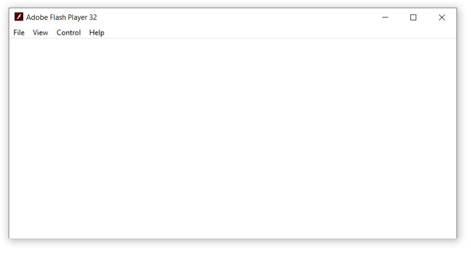

### Procedure

<strong>Laboratory Procedure for Estimation of Glucose:</strong>

<h4>Standardisation of Fehling’s Solution:</h4>

Prepare a standard glucose solution by accurately weighing 1.25&nbsp;g of glucose AR and dissolving it in a 250&nbsp;mL standard flask with water. Make up the volume to the mark.

Pipette out 20&nbsp;mL each of Fehling’s A and Fehling’s B into a dry conical flask and shake thoroughly. Then pipette 20&nbsp;mL of this freshly mixed Fehling’s solution into a clean conical flask and dilute it with 20&nbsp;mL of water. Heat the solution to 70&nbsp;°C over wire gauze.

Take the standard glucose solution in a burette and add it slowly to the boiling Fehling’s solution until the blue colour completely disappears. Maintain the temperature during each addition. Repeat the titration by steadily adding glucose solution to the boiling Fehling’s solution, and as you near the end point, switch to drop-by-drop addition until the blue colour just disappears.

<em>Alternative method:</em> To detect the end point more accurately, add 5–6 drops of methylene blue indicator to the Fehling’s solution. Then, add glucose solution drop by drop. If methylene blue is used, the Fehling’s solution should not be boiled for more than 2–3 minutes at a time. The end point is indicated by the disappearance of the blue colour.

<h4>Simulator Procedure:</h4>

<ol>
  <li>Choose the titrant.</li>
  <li>Choose the titrate.</li>
  <li>Select the normality of the titrate.</li>
  <li>Select the volume of the titrate.</li>
  <li>Start titration.</li>
  <li>When the blue colour just fades, select the indicator.</li>
  <li>Continue the titration.</li>
  <li>Note the end point at the colour change of the solution.</li>

  $$N_1V_1=N_2V_2$$
  
  <li>From the final reading, calculate the normality of the titrant using the appropriate equation.</li>
  <li>After finding the normality, the amount of substance in the whole of the given solution can be calculated by the equation:</li>
</ol>

$$\frac{\text{Atomic weight}\times \text{Normality}\times \text{Volume of the given solution upto which it is made up}}{1000}$$

**Note**: 10 times dilute the stoke solution and that is used as titrant.
Atomic weight of Glucose=180.1559 g/mol.

<strong>Observations and Calculations:</strong>

<table cellpadding="5" cellspacing="0">
  <tr>
    <th>NO</th>
    <th>Volume of Titrate (mL)</th>
    <th colspan="2">Burette Reading (mL)</th>
    <th>Volume of Titrant used (mL)</th>
  </tr>
  <tr>
    <td></td>
    <td></td>
    <td><em>Initial</em></td>
    <td><em>Final</em></td>
    <td></td>
  </tr>
  <tr>
    <td>1</td>
    <td></td>
    <td></td>
    <td></td>
    <td></td>
  </tr>
  <tr>
    <td>2</td>
    <td></td>
    <td></td>
    <td></td>
    <td></td>
  </tr>
</table>

Normality of Titrate used, N1=.............N. 

Volume of Titrate used, V1 =..............mL. 

Volume of Titrant Used, V2 =..............mL. 

Therefore, the Normality of Titrant  N2= $\frac{N_1V_1}{V_2}$ = ....................N

The amount of substance in the whole of the given solution =

$$\frac{\text{Atomic weight}\times \text{Normality}\times \text{Volume of the given solution upto which it is made up}}{1000}$$

$$=...................... \text{g}$$

## Result:

The amount of substance in the whole of the given solution = .............. g.

<strong>Points to Remember while Performing the Experiment in a Real Laboratory:</strong>

<ul>
  <li>Always wear a lab coat and gloves when in the lab.</li>
  <li>Switch on the exhaust fan upon entering the lab, and ensure all required chemicals and reagents are available. If not, prepare the reagents using appropriate components.</li>
  <li>Properly adjust the flame of the Bunsen burner. A proper flame is a small blue cone—not a large plume or an orange flame.</li>
  <li>Clean all working apparatus with chromic acid and distilled water, and ensure they are free from water droplets before starting the experiment.</li>
  <li>Calibrate the electronic weighing balance before taking any measurements.</li>
  <li>Clean all glassware with soap and distilled water. Once the experiment is completed, recap the reagent bottles.</li>
  <li>Before leaving the lab, switch off the lights, exhaust fan, and gas cylinder.</li>
  <li>Discard used gloves in the appropriate waste bin.</li>
</ul>

     

# Procedure to View the Experiment Animation.

    <a href="simulation/flash/flashplayer.exe" class="download-link" download>
      <svg xmlns="http://www.w3.org/2000/svg" width="18" height="18" fill="white" viewBox="0 0 16 16">
        <path d="M.5 9.9V14a1 1 0 0 0 1 1h13a1 1 0 0 0 1-1V9.9a.5.5 0 0 0-1 0V14H1V9.9a.5.5 0 0 0-1 0z"/>
        <path d="M7.646 11.854a.5.5 0 0 0 .708 0l3-3a.5.5 0 0 0-.708-.708L8.5 10.293V1.5a.5.5 0 0 0-1 0v8.793L5.354 8.146a.5.5 0 1 0-.708.708l3 3z"/>
      </svg>
      Click Here to Download Flash Player
    </a>
  

 

  
<h4>Flash Content link:</h4>

  
  
📋

  
Copied!

<h2>Instructions to run the Flash simulator on your system:</h2>

<strong>▶ Windows system</strong> 
<strong>Step 1:</strong> Open Flash Player 
 
<strong>Step 2:</strong> Copy the Flash content link by click the 📋 icon provided above. 

<strong>Step 3:</strong> Click <em>File → Open</em> from the Flash Player menu. 
<strong>Step 4:</strong> Paste the Flash content link in the Open window of the Flash Player and click the OK button. 
  

<strong>▶ Linux system</strong> 
<strong>Step 1:</strong> Install <code>Wine</code> on your Linux system. 
For Ubuntu: <code>sudo apt update</code> 
<code>sudo apt install wine</code> 
For Fedora: <code>sudo dnf install wine</code> 
<strong>Step 2:</strong> Open terminal and navigate to the folder where the Flash Player is downloaded. 
<strong>Step 3:</strong> Open the Flash Player using <code>wine flashplayer.exe</code> 
 
<strong>Step 4:</strong> Copy the Flash content link by click the 📋 icon provided above. 
<strong>Step 5:</strong> Click <em>File → Open</em> from the Flash Player menu. 
<strong>Step 6:</strong> Paste the Flash content link in the Open window of the Flash Player and click OK. 

