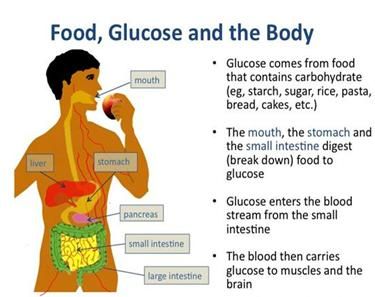
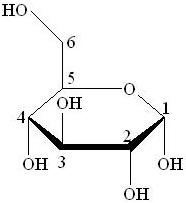
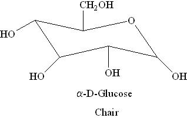
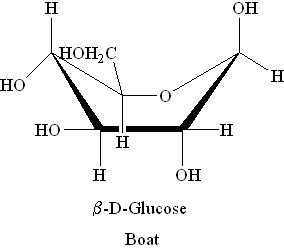
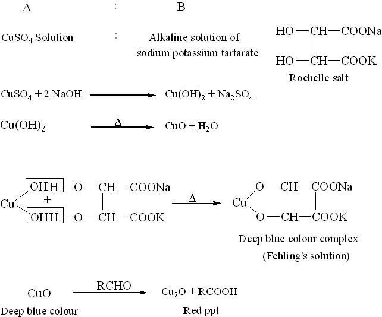

## Theory 

### Introduction:
 
#### Glucose:

 

  

 

Glucose is a very important monosaccharide in biology. It is one of the major products of photosynthesis. The living cell uses it as a source of energy and metabolic intermediate. The name "Gluc" comes from the Greek word "glykys", which means "sweet", plus the suffix "-ose" which denotes a sugar. 

Two stereoisomers of the aldohexose sugars are known as glucose, only one of which (D-glucose) is biologically active. This form (D-glucose) is often referred to as dextrose monohydrate, or, especially in the food industry, simply dextrose (from dextrorotatory glucose).

## Structure of Glucose:
 
### D or L Designation:

 

For the structure of carbohydrates the bonding pattern of the hydrogen and hydroxyl groups around each carbon atom is very important. An asymmetric carbon atom is that a carbon atom which is bonded to four different groups. Glucose, with six carbon atoms, has four asymmetric carbon atoms. The arrangement of the OH's and H's on these atoms is very important. Structural formulas for sugar molecules are often written in the vertical arrangement with the aldehyde or the ketone group at or near the top. When written in this particular way, the position of the OH on the last asymmetric carbon atom will tell us whether we are dealing with a "D" sugar or an "L" sugar. "D" stands for dextro and "L" stands for levo. If the OH is on the right, it is a "D" sugar, in this case D-glucose. If the OH is on the left, then it has been "L" sugars. When you see D's and L's in front of the names of carbohydrates, this is the reason for it.

## Fischer Projection Formula:

<strong>Hermann Emil Fischer</strong> in 1891 devised the Fischer projection. It is a two-dimensional representation of a three-dimensional organic molecule by projection. Fischer projections were originally proposed for the depiction of carbohydrates and used by chemists, particularly in organic chemistry and biochemistry. The use of Fischer projections in non-carbohydrates is discouraged; as such drawings are ambiguous when confused with other types of drawing.

In Fischer projection all bonds are depicted as horizontal or vertical lines, and these entire horizontal bonds project toward the viewer, while vertical bonds project away from the viewer. Therefore, a Fischer projection cannot be rotated by 90° or 270° in the plane of the page or the screen, as the orientation of bonds relative to one another can change, converting a molecule to its enantiomer.

The carbon chain is depicted vertically, with carbon atoms represented by the centre of crossing lines. The orientation of the carbon chain is so that the $C_1$ carbon is at the top. In an aldose, the carbon of the aldehyde group is $C_1$; and in a ketose the carbon of the ketone group has the lowest possible number (usually $C_2$ ).

According to IUPAC rules all hydrogen atoms should preferably be drawn explicitly. Especially the hydrogen atoms of the end group of carbohydrates should be present.

### Visualizing a Fischer projection:

### Haworth projection formula:

A Haworth projection is a common way of representing the cyclic structure of a monosaccharide with a simple three-dimensional perspective. The Haworth projection was named after the English chemist Sir Walter N. Haworth.

<strong>A Haworth projection has the following characteristics:</strong>

<ul>
  <li>Carbon is the implicit type of atom. In the example Fig (a), the atoms numbered from 1 to 6 are all carbon atoms. Carbon 1 is known as the Anomeric Carbon.</li>
  <li>Hydrogen atoms on carbon are implicit. In the example, atoms 1 to 6 have extra hydrogen atoms not depicted.</li>
  <li>A thicker line indicates atoms that are closer to the observer. In the example Fig (a), atoms 2 and 3 (and their corresponding OH groups) are the closest to the observer, atoms 1 and 4 are farther from the observer, and finally the remaining atoms (5, etc.) are the farthest.</li>
</ul>

### Boat and Chair Forms:

i) α-D-Glucose</li>

ii) β-D-Glucose

### Fehling's solution:

Fehling's solution is a chemical test used to differentiate between water-soluble aldehyde and ketone functional groups, and as a test for monosaccharides. The test was developed by German chemist Hermann von Fehling in 1849.

### Laboratory Preparation:

Fehling's solution is always prepared fresh in the laboratory. It is made initially as two separate solutions, known as <strong>Fehling's A</strong> and <strong>Fehling's B</strong>.

<ul>
  <li><strong>Fehling's A:</strong> A blue aqueous solution of copper(II) sulphate pentahydrate crystals (CuSO4·5H2O).</li>
  <li><strong>Fehling's B:</strong> A clear solution of aqueous potassium sodium tartrate (Rochelle salt) and a strong alkali, typically sodium hydroxide (NaOH).</li>
</ul>

Equal volumes of Fehling’s A and B are mixed to prepare the final Fehling’s solution, which appears deep blue in color. In this mixture, aqueous tartrate ions from the Rochelle salt chelate with Cu2+ (aq) ions from copper sulphate, acting as bidentate ligands to form the bistartratocuprate(II) complex.

### Uses of Fehling's Solution:

Fehling's solution can be used to determine whether a carbonyl-containing compound is an aldehyde or a ketone. The bistartratocuprate(II) complex in Fehling's solution is an oxidizing agent and the active reagent in the test.

The compound to be tested is added to the Fehling's solution and the mixture is heated. Aldehydes are oxidized, giving a positive result, but ketones do not react — unless they are α-hydroxy ketones. The bistartratocuprate(II) complex oxidizes the aldehyde to a carboxylate anion, and in this process, the copper(II) ions (Cu2+) of the complex are reduced to copper(I) ions (Cu+). Red copper(I) oxide (Cu2O) then precipitates out of the reaction mixture, which indicates a positive result. This is a redox reaction. A negative result (no red precipitate) indicates the absence of an aldehyde group. Note: Fehling’s solution does not react with aromatic aldehydes — for those, Tollens' reagent should be used instead.

Fehling’s test can be used as a general test for monosaccharides. It gives a positive result for aldose monosaccharides (due to the oxidizable aldehyde group), but also for ketose monosaccharides — since they are isomerized to aldoses under the basic conditions of the test. Thus, Fehling's reagent is often referred to as a general test for reducing sugars.

Fehling’s solution is also used to detect glucose in urine, helping in diabetes screening. Another use is in the hydrolysis of starch to glucose syrup and maltodextrins, where it is used to measure the amount of reducing sugars and calculate the dextrose equivalent (DE) of starch sugars.

### Methylene Blue:

Methylene blue is a heterocyclic aromatic chemical compound with the molecular formula C16H18N3SCl. It has many applications in both biology and chemistry. At room temperature, it appears as a dark green, odourless solid powder, which yields a blue solution when dissolved in water.

Methylene blue should not be confused with methyl blue (a different histology stain), new methylene blue, or the methyl violets commonly used as pH indicators. The International Nonproprietary Name (INN) for methylene blue is <em>methylthioninium chloride</em>.

Methylene Blue

### Methylene Blue as Redox Indicator:

Methylene blue is widely used as a redox indicator in analytical chemistry. In an oxidizing environment, solutions of this substance are blue; when exposed to a reducing agent, it turns colourless.

The redox properties of methylene blue are demonstrated in the classical "blue bottle" experiment in general chemistry. Typically, a solution of dextrose, methylene blue, and sodium hydroxide is used. Upon shaking the bottle, oxygen oxidizes methylene blue, turning the solution blue. Over time, dextrose reduces the methylene blue to its colourless, reduced form. Once the dissolved oxygen is completely consumed, the solution becomes colourless.

### Theory of Estimation of Glucose:

A freshly prepared Fehling’s solution is first standardized by titration against a standard solution of pure glucose (A.R. grade). The standardized Fehling’s solution is then used to determine the amount of glucose in an unknown sample or solution through direct titration.

Fehling’s solution contains cupric ions (Cu2+) and is blue in colour. At the end point of the titration, it forms a red precipitate of cuprous oxide (Cu2O). Because the supernatant liquid remains blue and the precipitate is red, determining the endpoint visually can be challenging. To improve accuracy, methylene blue is sometimes used as an indicator for detecting the endpoint more clearly.

C6H12O6 + 2CuO &rarr; C6H11O5.COOH + Cu2O

<strong>Glucose</strong> + <strong>Cupric Oxide</strong> &rarr; <strong>Gluconic Acid</strong> + <strong>Cuprous Oxide</strong>

<em>(Fehling’s solution)</em>

